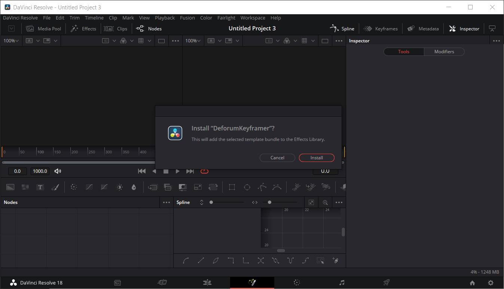
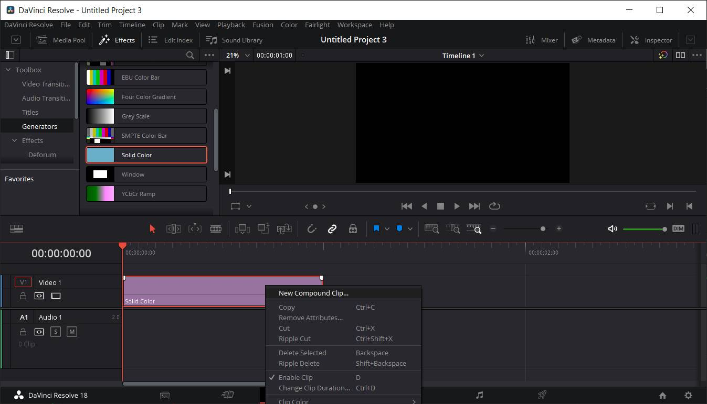
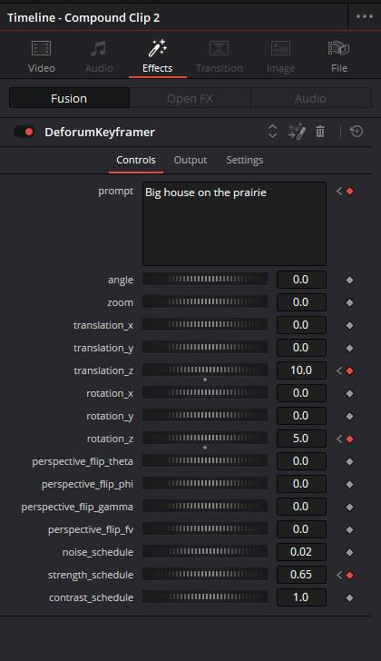
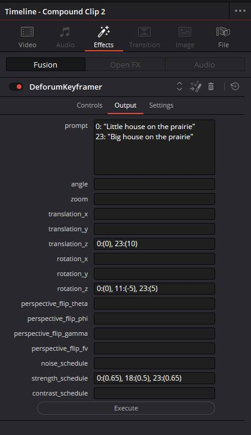
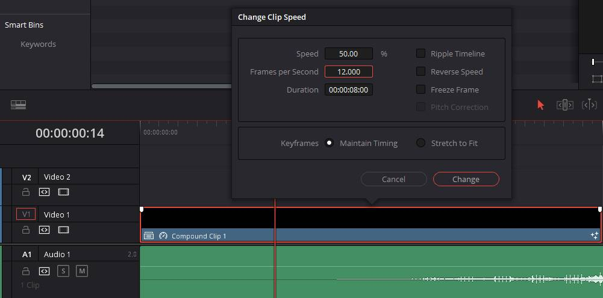

# DeforumKeyframer

## What this is
This is a macro for Davinci Resolve/Fusion to assist with creating keyframes for Deforum Stable Diffusion. You can view your keyframes on the timeline, making it easier to visualize your animation or synchronize to music and video.

## What this is NOT
This does not bring Stable Diffusion into Davinci Resolve. It simply generates a list of keyframe data that can be copied into Deforum Stable Diffusion.

## Installation
### Prerequisites
- https://www.blackmagicdesign.com/products/davinciresolve/
- https://deforum.github.io/

### Download
Download DeforumKeyframer.drfx from the [releases](https://github.com/Zarxrax/DeforumKeyframer/releases) page

### Installing DeforumKeyframer
- Open DaVinci Resolve, and navigate to the fusion page. 
- Drag and drop the DeforumKeyframer.drfx file into the fusion page. It should prompt you to install. 

## How to use
### Setting the frame rate
First of all, because Deforum uses frame numbers rather than timecodes, it is important to make sure that the frame rate in your DaVinci Resolve project settings and timeline settings match the frame rate that is used in Deforum. Unfortunately, Resolve only supports a limited selection of frame rates, so I would recommend going with a standard one like 24 or 30 (I would avoid decimals for simplicity). If you prefer to use a lower framerate like 12, there is a workaround that can be done to achieve this, which I will explain further on below. For now, just make sure that the frame rate in your project settings is a multiple of your target frame rate. For example, if you want to use a frame rate of 12 in Deforum, set up your project in resolve to use 24.

### Applying the effect
The effect can be used either on the Edit page or the Fusion page. If you will be working in a lower frame rate, or attempting to synchronize to audio, I recommend working in the Edit page.

From the Edit page, create a new Solid Color (from the effects menu, Generators > Solid Color). Make sure the solid is long enough to contain your entire animation. Then right-click on the solid and select the option to create a new compound clip. Finally, locate the the DeforumKeyframer effect from the effects menu and drop it onto the compound clip.

### Using the effect
You can use the controls on the effect's "controls" page to set keyframes. Please note that curves/easing will not transfer over to Deforum!
If you go to the "output" page and click the execute button, your keyframe data will populate into the various fields. You can copy and paste from these fields into the Deforum notebook.

 

### Working at a lower frame rate
If you prefer to use a frame rate that is lower than what resolve supports, then we can achieve this by adjusting the clip speed settings.
All you need to do is right click on the clip that the DeforumKeyframer effect was applied to, and select "change clip speed". Here, change the fps to match what you will be using in Deforum. To avoid confusion, I strongly recommend that you only select a number that is evenly divisible by your project framerate.
While working like this, make sure not to place keyframes on adjacent frames, because it is likely that one of them will end up missing. For example, if your project is 24 frames per second, but you are working with a 12 frames per second clip, resolve will still actually display all 24 frames on the timeline, but only half of those frames can have unique keyframes! 

## Roadmap
Future plans currently include:
- Make additional versions that only expose either 2D or 3D controls

## Source Code
All code is in the file DeforumKeyframer.setting
It is a Fusion macro written in Lua.
