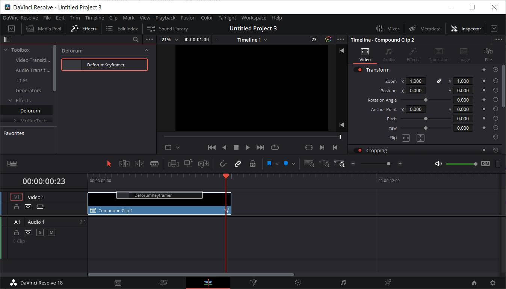

# DeforumKeyframer

## What this is
This is a macro for Davinci Resolve/Fusion to assist with creating keyframes for Deforum Stable Diffusion. You can view your keyframes on the timeline, making it easier to visualize your animation or synchronize to music and video.

## What this is NOT
This does not bring Stable Diffusion into Davinci Resolve. It simply generates a list of keyframe data that can be copied into Deforum Stable Diffusion.

## Installation
### Prerequisites
- https://www.blackmagicdesign.com/products/davinciresolve/
- https://deforum.github.io/

### Download
Download DeforumKeyframer.drfx from the [releases](https://github.com/Zarxrax/DeforumKeyframer/releases) page

### Installing DeforumKeyframer
- Open DaVinci Resolve, and navigate to the fusion page. 
- Drag and drop the DeforumKeyframe.drfx file into the fusion page. It should prompt you to install. 

## How to use
First of all, because deforum uses frame numbers rather than timecodes, it is important to make sure that the frame rate in your DaVinci Resolve project settings and timeline settings match the frame rate that is used in Deforum. Unfortunately, Resolve only supports a limited selection of frame rates, so I would recommend going with a standard one like 24.

The effect can be used either on the Edit page or the Fusion page. 
If you want to use it on the Edit page, the easiest way is to create a new compound clip from a solid, then drop the DeforumKeyframer effect onto the compound clip. Make sure the solid is long enough to contain your entire animation.

You can use the controls on the effect's "controls" page to set keyframes. Please note that curves/easing will not transfer over to Deforum!
If you go to the "output" page and click the execute button, your keyframe data will populate into the various fields. You can copy and paste from these fields into the Deforum notebook.

 

## Roadmap
Future plans currently include:
- Make additional versions that only expose either 2D or 3D controls
- Look for workarounds to support more frame rates
- Investigate different workflows to determine pros and cons of using on the Edit page vs the Fusion page

## Source Code
All code is in the file DeforumKeyframer.setting
It is a Fusion macro written in Lua.
